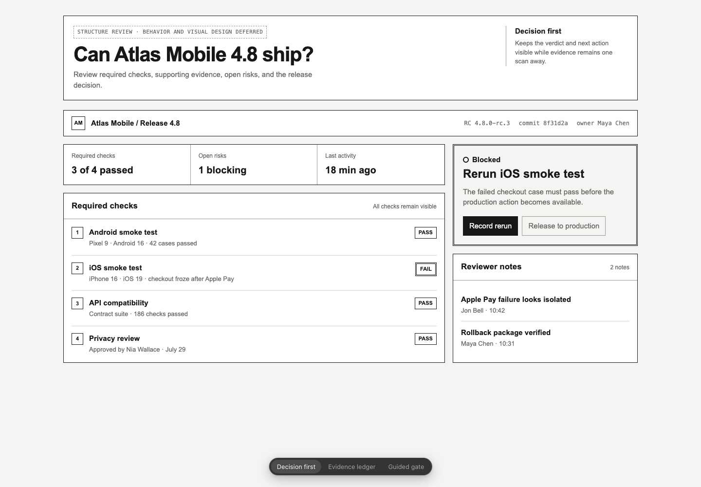
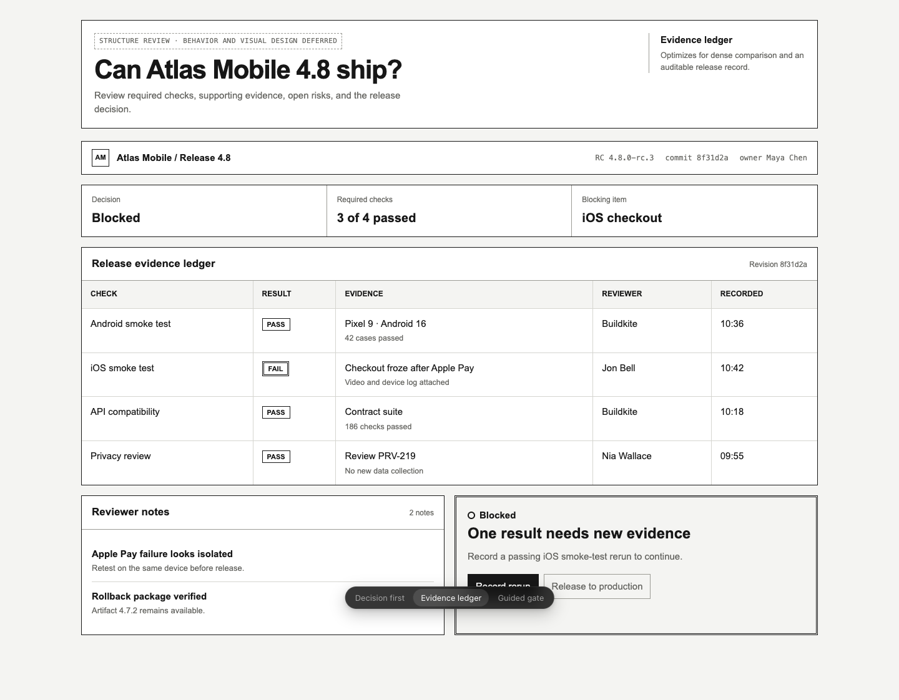
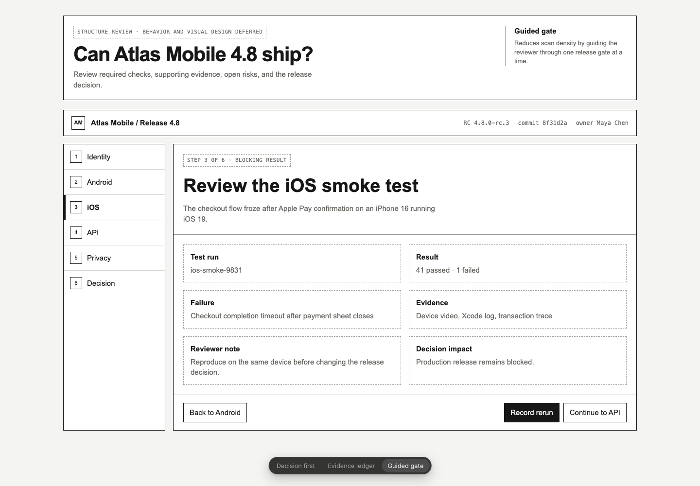
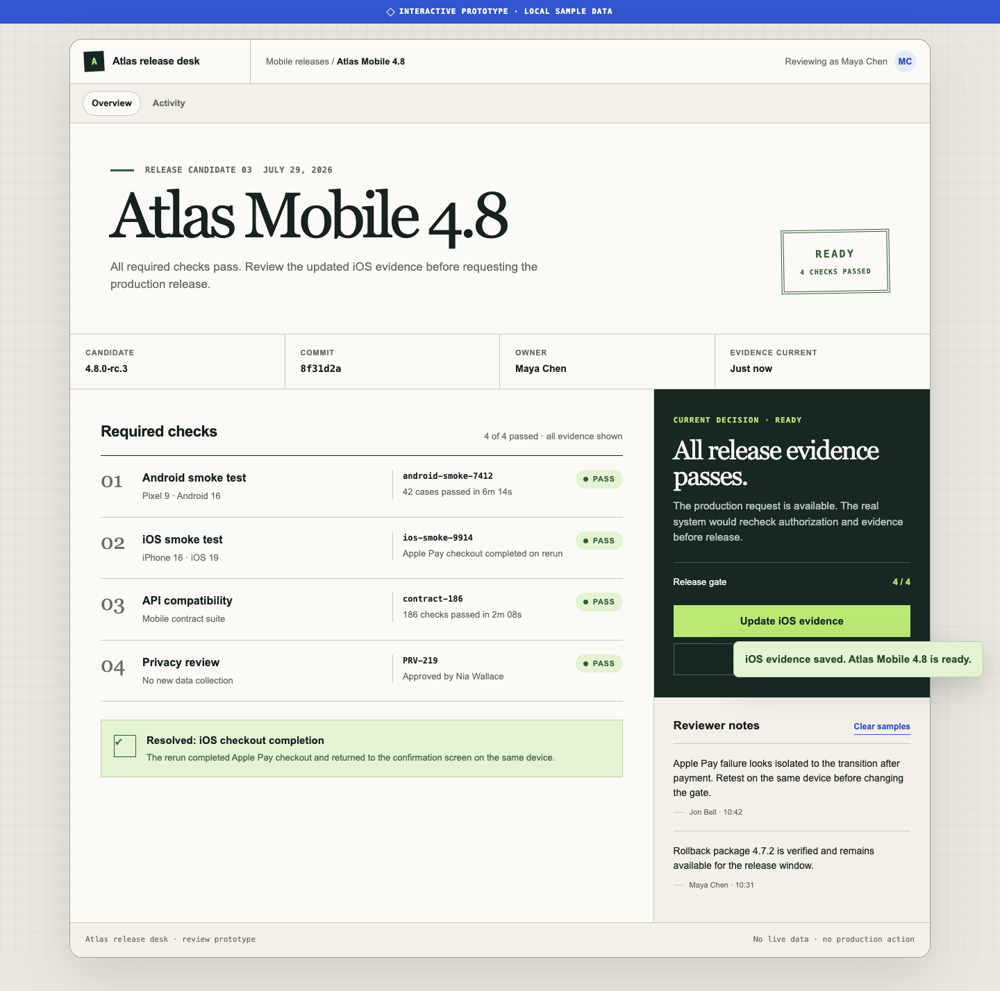

# Release readiness example

This example takes one product brief from structural exploration to working interaction. Both artifacts are self-contained HTML files that can be opened directly, copied, and changed without build tooling.

## 1. Wireframe

[Open the wireframe](wireframe.html)

The wireframe keeps the visual treatment deliberately plain and compares three structural directions:

- **Decision first** keeps the release verdict visible beside the checks.
- **Evidence ledger** favors dense comparison and auditability.
- **Guided gate** turns the decision into a step-by-step review.

Decisions at this stage include content, grouping, navigation, task order, and mobile reflow. Color, typography, component styling, and animation remain open.

| Decision first | Evidence ledger | Guided gate |
| --- | --- | --- |
|  |  |  |

## 2. Prototype

[Open the prototype](prototype.html)

The prototype adds the smallest complete flow needed to test the decision:

1. Review the failed iOS smoke test.
2. Record a passing rerun in a keyboard-accessible dialog.
3. See the release change from blocked to ready.
4. Request a production release and reach the explicit prototype boundary.

The artifact includes loading, error, success, disabled, empty-notes, mobile, and reduced-motion states. It does not authenticate a user, save data, or start a real release.



See the [validation record](validation.md) for browser, interaction, accessibility, clean-invocation, and packaging checks.

## Clone and adapt

Copy the artifact closest to the question you need to answer:

```bash
cp examples/release-readiness/wireframe.html my-flow.html
cp examples/release-readiness/prototype.html my-prototype.html
```

Replace the brief, labels, data, and state model before changing the visual direction. A useful adaptation keeps the review question clear and removes controls that do not support it.
